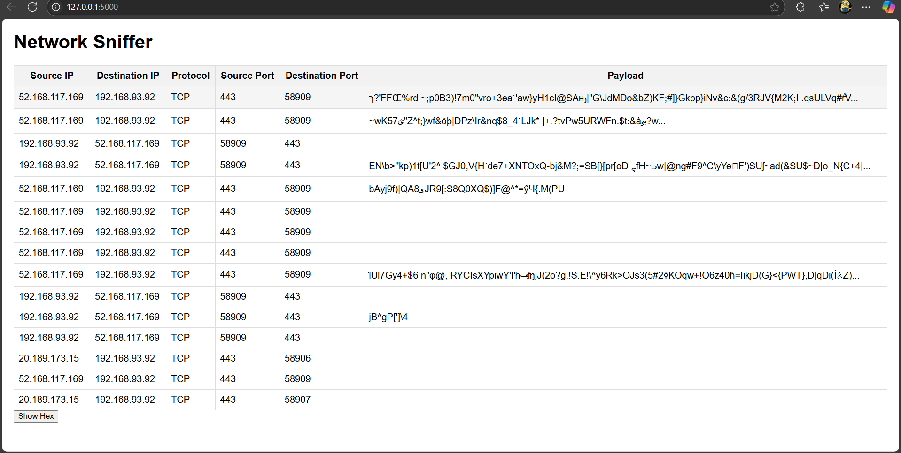

# CodeAlpha Project - Basic Network Sniffer

This project is a basic network sniffer application implemented in Python. It includes a graphical user interface and templates for display.

## Features

- Captures network packets
- Displays captured data in a user-friendly interface

## How to Run

1. Ensure you have Python installed (version 3.x recommended).
2. Run the main application script:

```
python app.py
```

3. The application window will open, allowing you to start capturing network data.

## Sample Output




## Contributing

Feel free to fork the repository and submit pull requests for improvements or bug fixes.

## License

This project is open source and available under the MIT License.
